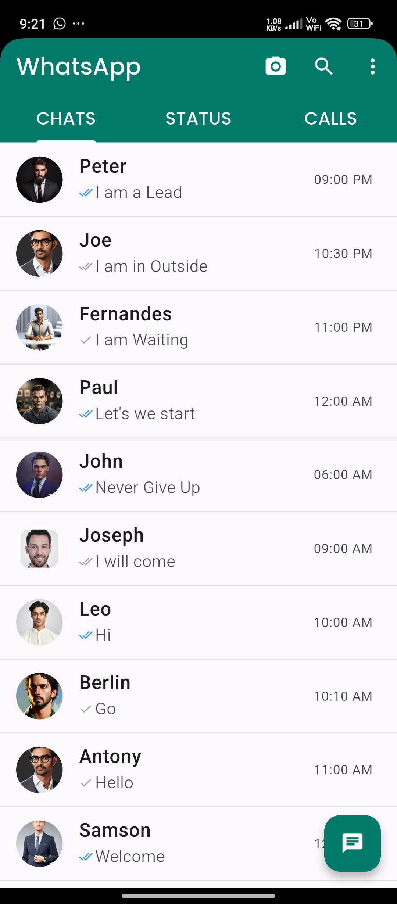
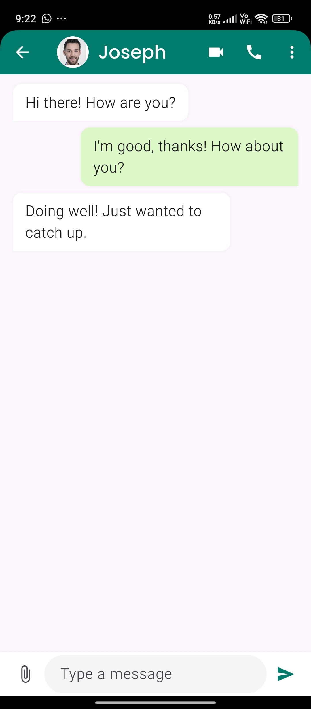
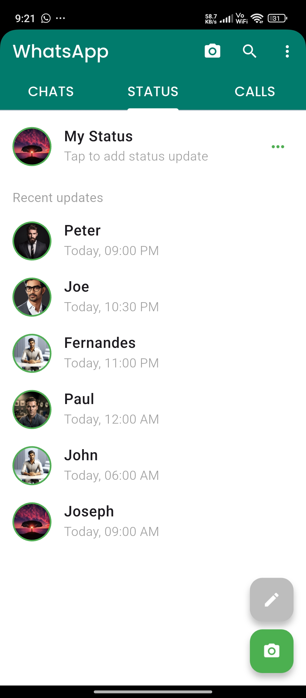
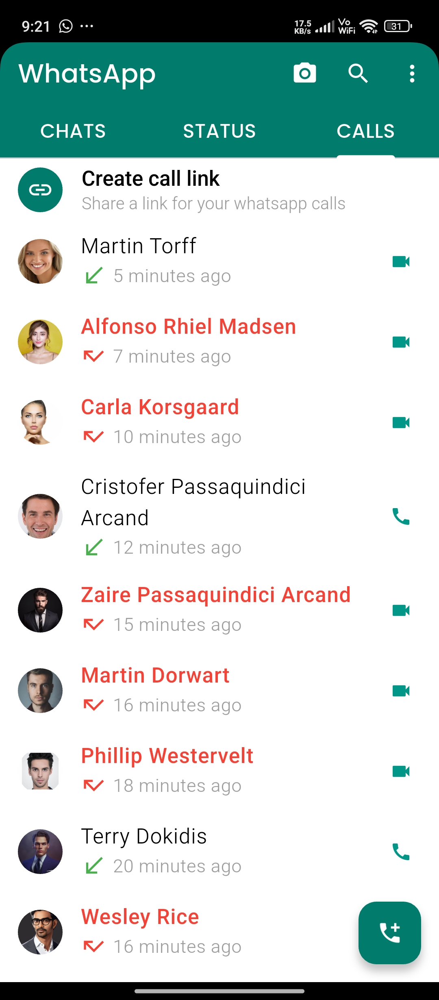

# WhatsApp UI Clone - Flutter

A WhatsApp UI clone built using Flutter, featuring essential screens such as chat, calls, status, settings, and payments. This project is designed to mimic the interface and user experience of WhatsApp, making it a great starting point for learning Flutter and UI development.

## 📌 Features
- **Chat Page** - Displays chat conversations in a WhatsApp-like format.
- **Call Page** - Shows recent calls and call history.
- **Status Page** - Displays status updates from contacts.
- **Home Page** - Main screen with navigation to chats, status, and calls.
- **Payment Page** - Represents a UI for payments (concept only).
- **Settings Page** - Contains user settings and preferences.
- **Full-Screen Image View** - Allows users to view images in full screen.
- **Device Linking Page** - Represents the UI for linking WhatsApp Web or other devices.
- **Splash Screen** - A simple splash screen to enhance the app launch experience.

## 📂 Project Structure
```
lib/
├── Call_Page/
│   ├── call_page.dart
├── Chat_Page/
│   ├── chat_page.dart
├── Component/
│   ├── chat_bubble.dart
├── Full_Screen_Image_Page/
│   ├── full_screen_image_page.dart
├── Home_Page/
│   ├── home_page.dart
├── Link_Devices_Page/
│   ├── link_devices_page.dart
├── Message_Page/
│   ├── message_page.dart
├── Models/
│   ├── calls_model.dart
│   ├── settings_models.dart
│   ├── status_model.dart
│   ├── user_model.dart
├── Payment_Page/
│   ├── payment_page.dart
├── Settings_Page/
│   ├── settings_page.dart
├── Splash_Screen_Page/
│   ├── splash_screen.dart
├── Status_Page/
│   ├── status_page.dart
├── main.dart
```

## 🚀 Getting Started
### Prerequisites
- Flutter SDK installed
- Dart SDK installed
- Android Studio or VS Code with Flutter extension

### Installation
1. **Clone the repository**
   ```sh
   git clone https://github.com/your-username/whatsapp-ui-flutter.git
   cd whatsapp-ui-flutter
   ```
2. **Install dependencies**
   ```sh
   flutter pub get
   ```
3. **Run the project**
   ```sh
   flutter run
   ```

## 📸 Screenshots
Below are some high-quality screenshots of the app UI:

<p align="center">
  
  
</p>

<p align="center">
  
  
</p>

## 🛠️ Technologies Used
- **Flutter** - UI toolkit for building natively compiled applications
- **Dart** - Programming language for Flutter development
- **Firebase (if implemented)** - Backend services for authentication and database

## 💡 Future Enhancements
- Add real-time chat functionality
- Integrate Firebase for authentication and data storage
- Implement dark mode
- Improve animations and UI enhancements

## 🤝 Contributing
Contributions are welcome! Feel free to fork this project, make changes, and submit a pull request.

## 📄 License
This project is open-source and available under the [MIT License](LICENSE).

## 📬 Contact
For any queries or suggestions, reach out to me at [jagavanthaarunkumar@gmail.com] or connect on [LinkedIn](https://linkedin.com/in/jaga0001)